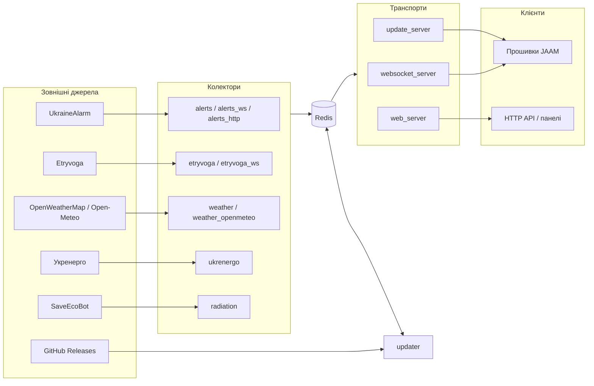

[](http://stand-with-ukraine.pp.ua/)
[](http://stand-with-ukraine.pp.ua/)

# JAAM Server

Серверна частина екосистеми **JAAM** — набір мікросервісів, які збирають дані з зовнішніх джерел (тривоги, погода, радіація, стан енергомережі), нормалізують їх і віддають пристроям JAAM через WebSocket, а людям — через HTTP API та веб-панелі.

Обслуговує обидва покоління прошивки:

| Репозиторій | Що це | Протокол до цього сервера |
|---|---|---|
| [J-A-A-M/jaam_fusion](https://github.com/J-A-A-M/jaam_fusion) | Прошивка JAAM Fusion 5.x (ESP32 / S3 / C3) | бінарний, `ws://…/data_fusion_v1` |
| [J-A-A-M/ukraine_alarm_map](https://github.com/J-A-A-M/ukraine_alarm_map) | Попереднє покоління прошивки, не розвивається | JSON, `ws://…/data_v4` (v1–v3 — сумісність зі старішими) |

Репозиторій відокремлено від `ukraine_alarm_map` (там код досі лежить у теці `deploy/` і більше не розвивається).

## Ресурси проєкту

- [Портал даних](http://jaam.net.ua) · [Flasher](https://flasher.jaam.net.ua/) · [WIKI](https://github.com/J-A-A-M/ukraine_alarm_map/wiki)
- [Телеграм-канал](https://t.me/jaam_project) · [Чат](https://t.me/jaam_discussions) · [Крамниця](https://store.jaam.net.ua/)

---

## Архітектура

Усе спілкування між сервісами — **через Redis**: колектори пишуть сирі дані, `updater` їх перетворює, транспорти читають готове. Прямих викликів між контейнерами немає.



### Потік даних

1. **Колектори** опитують або слухають зовнішнє джерело і кладуть сирий JSON у Redis за ключами `<джерело>:<…>:data` + `<…>:updated`, після чого публікують подію в pub/sub-канал.
2. **`updater`** підписаний на ці канали. Він — єдине місце, де сирі дані перетворюються на всі споживчі формати: legacy-масиви `websocket:v1|v2:legacy:*` та бінарні payload-и `websocket:v1:fusion:*`. Уся чиста логіка винесена в `updater/processing/` (саме її покриває pytest). Він же дзеркалить `.bin` релізів прошивки з GitHub у `/shared_data`.
3. **Транспорти** лише читають готове з Redis і віддають клієнтам.

## Сервіси

### Колектори

| Сервіс | Джерело | Примітки |
|---|---|---|
| `alerts/` | UkraineAlarm REST API v3 | потребує `ALERT_TOKEN` |
| `alerts_ws/` | UkraineAlarm WebSocket | опційно через SOCKS-проксі |
| `alerts_http/` | UkraineAlarm HTTP/HTML | оновлення токена, проксі |
| `etryvoga/` | Etryvoga HTTP | вибухи, ракети, дрони, КАБи |
| `etryvoga_ws/` | Etryvoga socket.io | те саме в реальному часі |
| `weather/` | OpenWeatherMap One Call 3.0 | період ≥ 7200 с |
| `weather_openmeteo/` | Open-Meteo | альтернатива без ключа |
| `ukrenergo/` | Укренерго | стан енергомережі по областях |
| `radiation/` | SaveEcoBot | гамма-фон, агрегація по областях |

### Обробка

| Сервіс | Роль |
|---|---|
| `updater/` | центральний трансформер: pub/sub-цикл + чисті функції в `processing/` |
| `trigger/` | ручна публікація повідомлення в довільний pub/sub-канал (для налагодження) |

### Транспорти

| Сервіс | Порт | Що віддає |
|---|---|---|
| `websocket_server/` | `38440` | `/data_v1`…`/data_v4` (JSON), `/data_fusion_v1` (бінарний), `/healthz` |
| `web_server/` | `8080` | `/alerts_statuses_v*.json`, `/weather_statuses_v*.json`, `/tcp_statuses_v*`, `/api_status.json`, Swagger на `/api` |
| `update_server/` | `8090` | OTA: `/list`, `/betalist`, `/{name}.bin`, `/fusion/…` |

### Панелі та допоміжне

| Сервіс | Порт | Роль |
|---|---|---|
| `admin_panel/` | `8099` | FastAPI + React/Vite/Tailwind + Postgres: реєстр пристроїв за `chip_id`, сесії, події online/offline/firmware, мапа, SSE. Див. [admin_panel/README.md](admin_panel/README.md) |
| `maps_online/` | `8095` | лічильник онлайн-мап, історія за 24 год |
| `device_map/` | `9095` | мапа розташування пристроїв |
| `store/` | `8090` | окремий інтернет-магазин (Starlette + SQLite + Нова Пошта). Див. [store/README.md](store/README.md) |
| `svg_generator/` | — | рендер PNG-мап тривог для порталу |
| `flasher/` | `80` | статичний Web-Serial прошивальник на nginx |
| `bot_guard/` | — | Telegram-бот проти спаму в чаті проєкту |
| `watchdog/` | — | рестарт контейнера за перевищенням CPU |
| `nginx/`, `redis/`, `logrotate/` | — | інфраструктура |
| `design/` | — | UI-прототипи та low-poly мапа. Див. [design/README.md](design/README.md) |

---

## Протокол fusion

Кадр: `type` (1 байт) + довжина тіла + тіло. Значення `type` мають збігатися з `utils.py` та `jaam_fusion/src/JaamConfig.h`.

| Байт | Константа на сервері | Тіло |
|---|---|---|
| `0xA1` | `TYPE_ALERTS_BATCH` | пари `region_id` (2B) + `flags16` (2B), лише змінені регіони + хеш попереднього стану |
| `0xA2` | `TYPE_NOTIFICATIONS_BATCH` | пари `region_id` + `flags16` |
| `0xA3` | `TYPE_WEATHER_BATCH` | `region_id` (2B) + температура (1B, закодована в 0…255) |
| `0xA4` | `TYPE_GRID_BATCH` | `region_id` (2B) + стан мережі (1B) |
| `0xA5` | `TYPE_RADIATION_BATCH` | `region_id` (2B) + рівень (1B) |
| `0xA6` / `0xA7` | `TYPE_FIRMWARE_UPDATE_BETA_BATCH` / `…_PROD_BATCH` | перелік доступних прошивок |

> У прошивці `0xA4` називається `TYPE_ENERGY_BATCH` — значення те саме, відрізняється лише назва.

Порядок байтів — little-endian. Alerts надсилаються діфами: перший пакет після підключення містить повний стан, далі сервер шле лише змінені регіони разом із хешем попереднього стану. Якщо хеш не збігається з локальним, прошивка перепідключається — і отримує повний стан наново.

### Рукостискання

Одразу після підключення пристрій надсилає три текстові кадри:

```
chip_id:<id пристрою>
firmware:<версія>_<firmware_id>
user_info:<json>
```

`user_info` у fusion містить лише `{"legacy": <hardware>}`; legacy-прошивка додає `kyiv_led`, `display_model`, `display_height` тощо. Ці поля — джерело даних для реєстру пристроїв в адмін-панелі.

---

## Розгортання

Продакшн — це Docker-контейнери на голому хості в мережі `jaam`, без compose. Кожен сервіс має свій `redeploy_<сервіс>.sh`, який робить `git pull`, збирає образ і перезапускає контейнер:

```bash
./redeploy_updater.sh -m redis -pw <redis_password> -db 0
./redeploy_web_server.sh -m redis -pw <redis_password>
```

Штатний шлях — GitHub Actions з `workflow_dispatch`: **☁️ Deploy Microservices** (чекбокси для колекторів і `web_server`), **⚖️ Deploy Websockets**, **🔄 Deploy Updater**, **📊 Deploy Admin Panel**, **🌐 Deploy Nginx**, **🗄️ Deploy Redis**, **🐘 Deploy Postgres** та інші. Кожен воркфлоу дозволяє обрати сервер (`Server 1` / `Server 2`).

Конфігурація — виключно через змінні оточення; обовʼязкові змінні перевіряються на старті й падають із `ValueError`, а не тихо підставляють дефолт.

---

## Розробка

```bash
pip install -r tests/requirements.txt
pytest tests/                      # спільний набір
pytest tests/admin_panel/          # тести адмін-панелі (окремо в CI)
```

Тести цілять у чисті функції з `updater/processing/` — саме тому логіка перетворення відокремлена від I/O.

Сервіси імпортують спільний кореневий `utils.py` через `try`/`except ImportError` з підстановкою батьківської теки в `sys.path`: так той самий файл працює і плоско в контейнері (`python updater.py`), і як пакет у тестах. `regions.json` шукається спершу поруч зі скриптом, потім на рівень вище — за тією ж логікою.

### CI

| Перевірка | Що |
|---|---|
| 🧹 Lint Check | Black (`--line-length 120`, target py313), flake8, proof-html для `flasher/src` |
| Server PyTests | pytest на Python 3.12 |

Перед комітом:

```bash
black --line-length 120 --target-version py313 .
```
